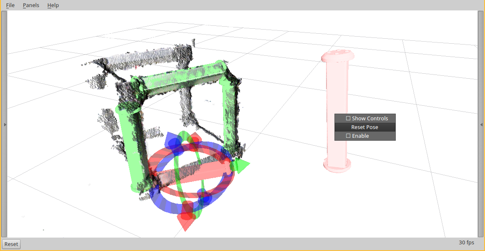

## Example Usage

### Pre-requisites

```
sudo apt-get install python-pip
sudo pip install catkin_tools
```

### Workspace

```
mkdir -p ~/gbeams_ws/src
cd ~/gbeams_ws/src
git clone git@github.com:jhu-lcsr/lcsr_assembly.git
git clone git@github.com:jhu-lcsr/lcsr_perception.git
git clone git@github.com:jhu-lcsr/lcsr_tf_tools.git
```

### Building

```
cd ~/gbeams_ws
catkin build
```

Make sure to run this in each shell you create after building:

```
source ~/gbeams_ws/devel/setup.bash
```

## Running

### roscore

First, run a `roscore` and `rviz`:

```
roscore
```

### Pointcloud PCD file

For a given pointcloud, siuch as `$(pwd)/1426895378754159.pcd`, run the following in a shell:
```
roslaunch manual_interactive_groundtruth pcd.launch pcd:=$(pwd)/1426895378754159.pcd
```

### Interactive Object Markers

Then, for each class of objects, run the following in a shell:

```
roslaunch manual_interactive_groundtruth object.launch mesh_uri:=package://gbeam_model/meshes/gbeam_link_50k.stl object_class:=gbeam_link n_objects:=8 file_id:=1 file_path:=$(pwd)
```

In the above example, we're using the `gbeam_link` class, and `file_id` `1`, so
the files will be written to `$(pwd)/gbeam_link_poses_1.csv`. The data is saved
when you ctrl-c the launchfile.

This csv file contains a pose on each line with `x y z` position and `qz qy qz
qw` quaternion orientation:

```
x y z qz qy qz qw
```

If you run the launchfile again with the same arguments, it will initialize the
poses of the objects from the csv file.

### RViz

Now in another shell, run RViz:

```
rosrun rviz rviz -d $(rospack find manual_interactive_groundtruth)/groundtruth.rviz
```

Once running RViz, you can enable or disable each object in the `Displays`
panel, and move them around with the interactive markers.


